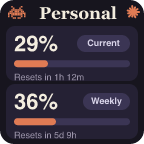

# Claude Duo — Stream Deck Usage Dashboard

Live **Claude Code usage for multiple accounts** on your Stream Deck — including a full-width dashboard that takes over the entire Stream Deck + touch bar.


Session and weekly limits for two Claude accounts, side by side, refreshed every 2 minutes. Bars turn amber at 70% and red at 90% so you see a limit coming before it stops you.

## Why this exists

Claude Code has 5-hour and weekly usage limits. Existing Stream Deck plugins show usage for **one** account — if you run two Claude subscriptions (a personal and a work account via `CLAUDE_CONFIG_DIR`), nothing out there displays both. This plugin does, and it renders them as one seamless panel across all four touch-strip slots.

## Features

- **Two accounts, one dashboard** — the only Stream Deck plugin that reads multiple Claude Code logins
- **Full touch-bar takeover** on Stream Deck + — 4 slots stitched into one 800px panel with the Claude spark
- **Adaptive layouts** — 1 slot = compact panel, 2 adjacent slots = wide panel, all 4 = full dashboard; regular keys work too (XL, MK.2, etc.)
- **Keychain-native** — reads the OAuth tokens Claude Code already maintains in the macOS Keychain; no API keys, no separate login, nothing leaves your machine except the same usage call Claude Code makes
- **Pixel-perfect rendering** — draws PNGs in-process with bundled font rendering (`@resvg/resvg-js`), because the Stream Deck app's own SVG text handling is unreliable
- **Rate-limit friendly** — sequential polling with backoff; last good data is persisted so restarts never show a blank panel
- **Dials control system volume** — the knobs under the strip stay useful
- **Tap to open** [claude.ai usage settings](https://claude.ai/settings/usage)
- **Sessions board** — swipe the touch bar to a second page showing your live Claude Code sessions (scanned from local `~/.claude/projects` transcripts): 🟢 working, 🟠 needs you, with a "N sessions need you" badge back on the usage page. **Tap a session to bring its terminal window to the front**, twist to scroll. No cloud, all local file mtimes.

## Install

Requires macOS, Stream Deck app 6.5+, and [Claude Code](https://claude.com/claude-code) logged in.

```bash
git clone https://github.com/fahimbinshad-tech/claude-duo-streamdeck.git
cd claude-duo-streamdeck/com.fahim.claude-duo.sdPlugin
npm install
ln -s "$(pwd)" "$HOME/Library/Application Support/com.elgato.StreamDeck/Plugins/com.fahim.claude-duo.sdPlugin"
killall "Stream Deck"; open -a "Elgato Stream Deck"
```

Then drag the two **Claude Duo** actions onto your deck. For the full-bar dashboard on a Stream Deck +, fill **all four dial slots**: slots 1–2 with Account 1, slots 3–4 with Account 2.

## Configure your accounts

Copy the example and edit:

```bash
cp accounts.example.json accounts.json
```

```json
{
  "personal": { "label": "Personal",  "service": "Claude Code-credentials" },
  "business": { "label": "Work",      "service": "Claude Code-credentials-xxxxxxxx" }
}
```

- `service` is the macOS Keychain entry Claude Code stores its OAuth token in. Your default account is `Claude Code-credentials`. A second account (one you log into with `CLAUDE_CONFIG_DIR=~/.claude2 claude`) gets a hashed suffix. Find yours:

  ```bash
  security dump-keychain 2>/dev/null | grep '"svce"' | grep 'Claude Code' | sort -u
  ```

  (The suffix is the first 8 hex chars of `sha256` of your config dir path.)
- `label` is what shows on the panel.
- `account` (optional) is the Keychain account name; defaults to your macOS username.

Single account? Leave `business.service` as `null` — that panel shows "add account" until you configure it.

## How it works

A ~400-line dependency-light Node plugin (no SDK framework): it speaks the Stream Deck WebSocket protocol directly, reads tokens with `security find-generic-password`, polls Anthropic's OAuth usage endpoint, and pushes rendered PNGs to keys (`setImage`) and touch-strip slots (`setFeedback`). Multi-slot panels are rendered once and sliced per slot with SVG `viewBox` offsets, so adjacent slots line up into one continuous image.

The plugin never refreshes OAuth tokens itself (refresh tokens rotate — consuming one would log Claude Code out). If a token expires, the panel says so; running `claude` once fixes it.



## Credits

Design inspired by the [Musing](https://musing.framer.website/) hardware usage monitor and the wave of Claude usage monitors the community has been building ([Claude Deck](https://jonnyelwyn.co.uk/blog/claude-code-usage-on-a-stream-deck/), [streamdeckclaude](https://github.com/Darhkfox/streamdeckclaude), [stream-deck-ai-limits](https://github.com/lenadweb/stream-deck-ai-limits)).

Built with [Claude Code](https://claude.com/claude-code). MIT license.
